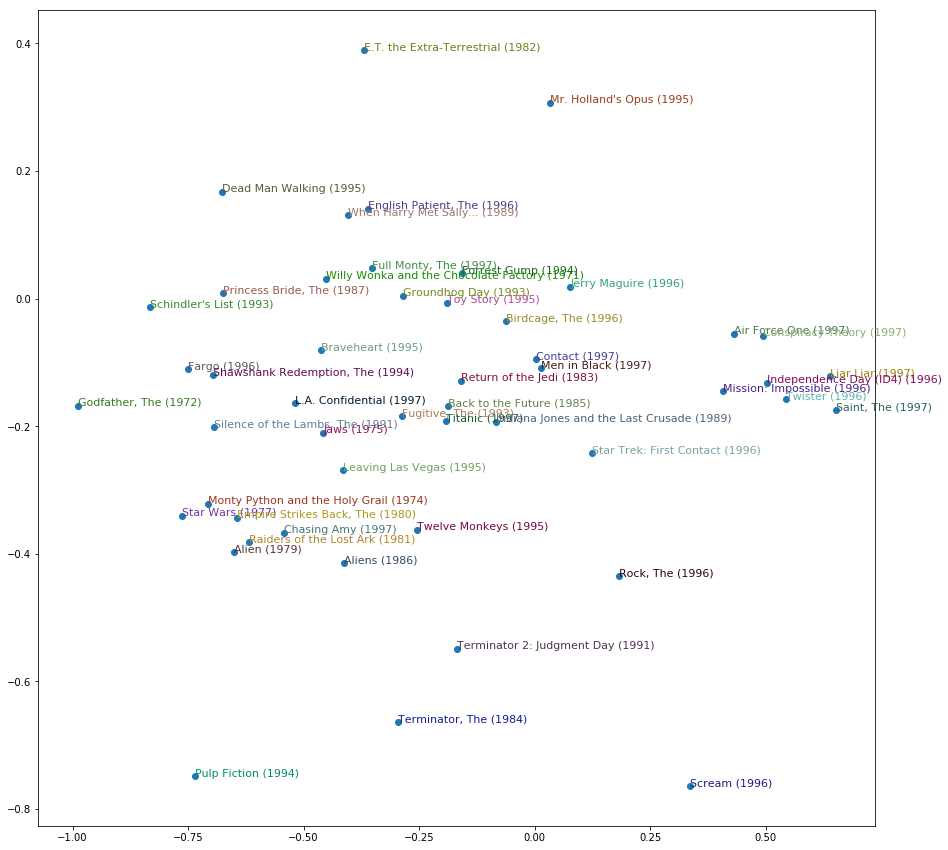

## Collaborative filtering

I trained a deep neural network using the fast.ai library, which works on top of the famous PyTorch library, to create a reccomender system for movies using a modified version of the [Movielens dataset](http://files.grouplens.org/datasets/movielens/ml-100k.zip). This version of the dataset has only 100k of rows. Once I trained the model, I applied a PCA on the weights to see if it has been detected any particular component.

## IPython Notebooks:

- [Movies Recommendation System](https://nbviewer.jupyter.org/github/vorsatti/Deep-Learning/blob/master/Collaborative%20filtering/Movies%20Recommendation%20System.ipynb)

#### Principal components in 2D

