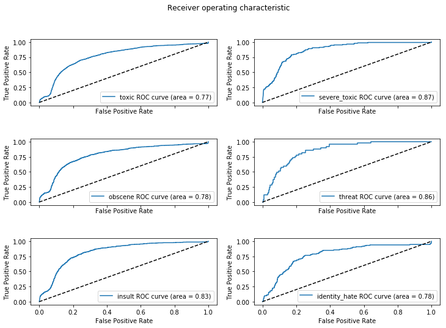
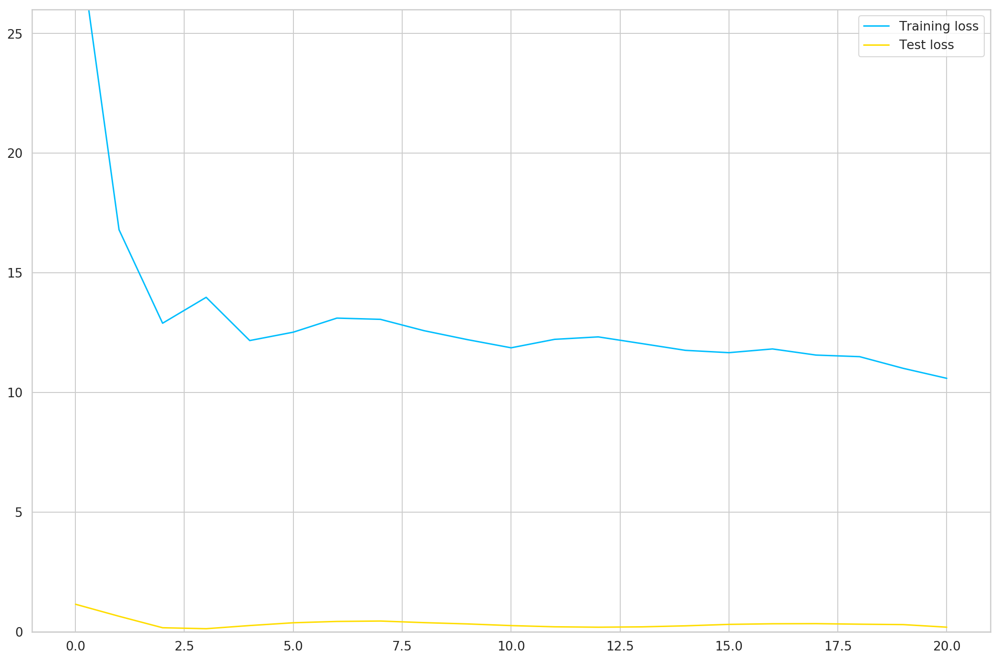
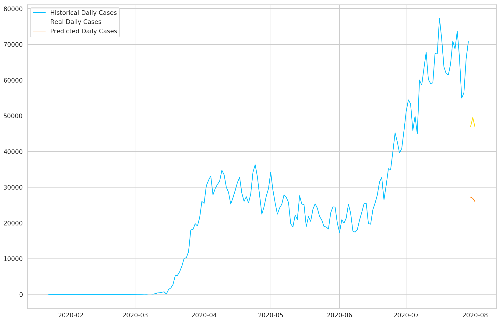

## Recurrent Neural Network

I trained a RNN using the fast.ai library, which works on top of the famous PyTorch library, to detect different types of of toxicity like threats, obscenity, insults, and identity-based hate. The dataset comes from the kaggle competition [Toxic Comment Classification Challenge](https://www.kaggle.com/c/jigsaw-toxic-comment-classification-challenge/overview). My approach was, first, made a language model to teach the NN the language used in these comments and then, I trained the classifier model to predict a probability for each of the six possible types of comment toxicity.

## IPython Notebooks:

- [Toxicity classification](https://nbviewer.jupyter.org/github/vorsatti/Deep-Learning/blob/master/RNN/Toxicity_classification.ipynb)

## Evaluation of the model

## Recurrent Neural Network with LSTM

I trained a LSTM using the PyTorch library, to forecast daily cases of the Novel Coronavirus. The data is provided by the Johns Hopkins University Center for Systems Science and Engineering (JHU CSSE) and contains the number of reported daily cases by country. [The dataset is available on GitHub](https://github.com/CSSEGISandData/COVID-19/tree/master/csse_covid_19_data/csse_covid_19_time_series) and is updated regularly.

## IPython Notebooks:

- [Forecasting Daily Coronavirus Cases with LSTMs](https://nbviewer.jupyter.org/github/vorsatti/Deep-Learning/blob/master/RNN/Forecasting%20Daily%20Coronavirus%20Cases%20with%20LSTMs.ipynb)

## Evaluation of the model

