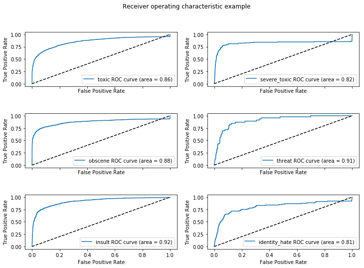

## Recurrent Neural Network

I trained a RNN using the fast.ai library, which works on top of the famous PyTorch library, to detecting different types of of toxicity like threats, obscenity, insults, and identity-based hate. The dataset comes from the kaggle competition [Toxic Comment Classification Challenge](https://www.kaggle.com/c/jigsaw-toxic-comment-classification-challenge/overview). My approach was, first, made a language model to teach the NN the language used in these comments and then, I trained the classifier model to predict a probability for each of the six possible types of comment toxicity.

## Results of the model

